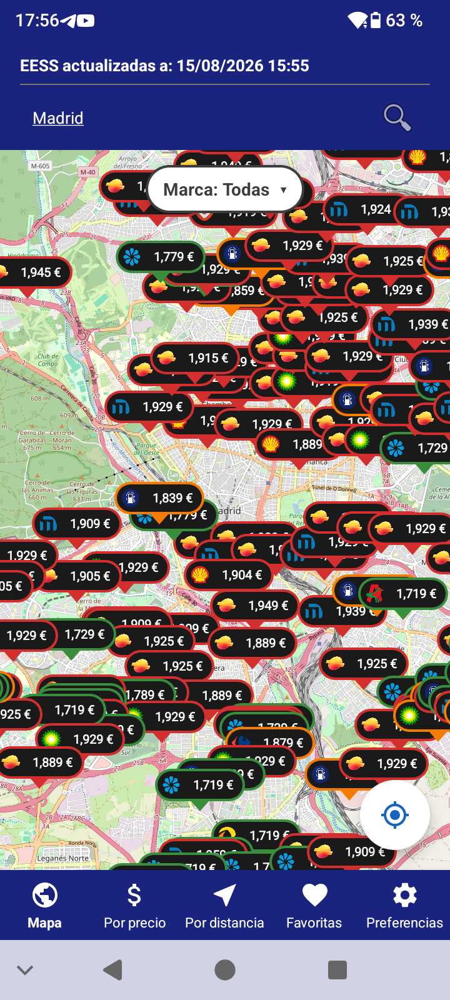
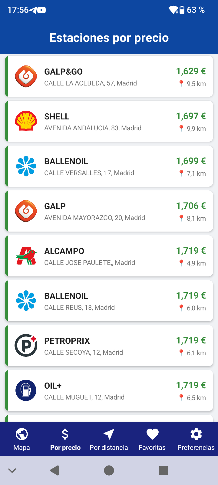
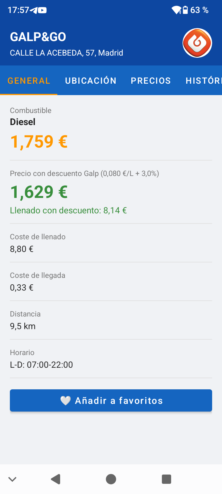
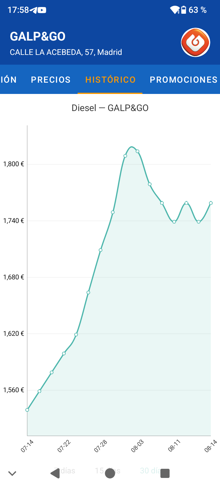
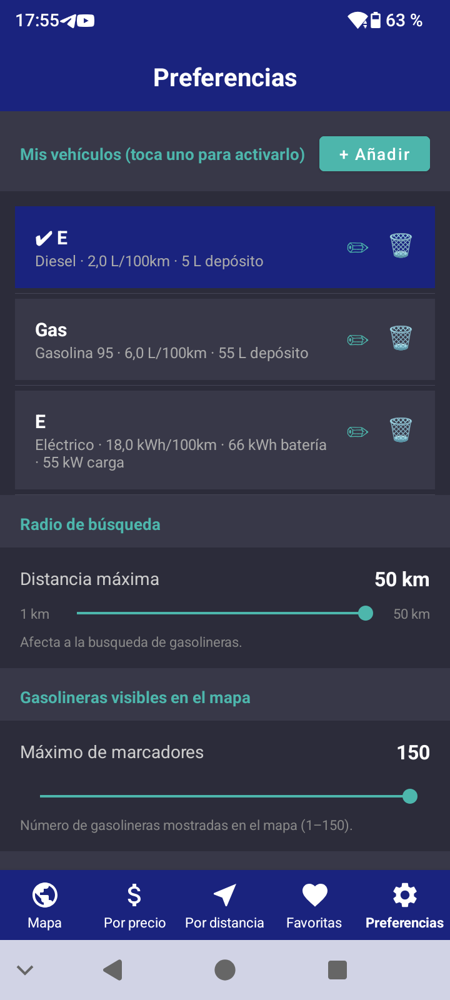
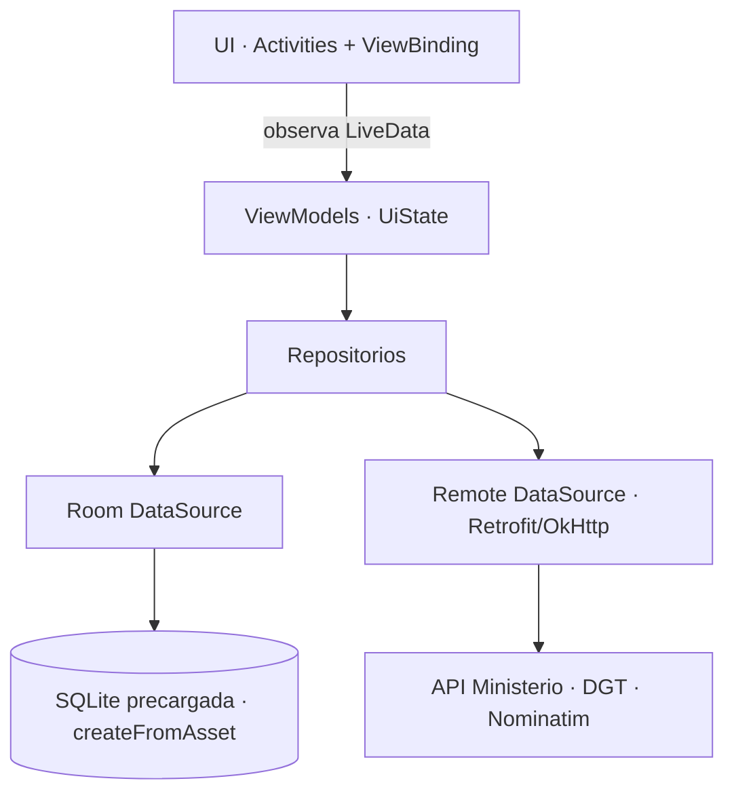

# ⛽ AhorraGas

**Encuentra la gasolinera más barata cerca de ti y calcula cuánto ahorras de verdad** — con precios oficiales del Ministerio, tu vehículo y tus descuentos.

App Android nativa (Java) que muestra en un mapa las estaciones de servicio de España con sus precios en tiempo real, las ordena por precio o distancia y estima el coste real de repostar según el consumo de tu coche y los descuentos de cada marca.


> Proyecto de Fin de Grado (2º DAM) **calificado con 10/10**, en proceso de pulido para publicarlo en Google Play.

---

## 📱 Capturas

<p align="center">
  &nbsp;
  &nbsp;
  
</p>
<p align="center">
  &nbsp;
  
</p>

<p align="center"><sub>Mapa por precio · Lista ordenada · Detalle con ahorro · Histórico (30 días) · Vehículos y radio</sub></p>

---

## ✨ Características

- 🗺️ **Mapa interactivo** (OpenStreetMap) con un marcador por estación coloreado según lo cara que es respecto a la zona (verde = barata, rojo = cara).
- 🔎 **Búsqueda por localidad** (geocodificación con Nominatim) y **filtro por marca**.
- 💲 **Ordenación por precio** o 📍 **por distancia**, con el precio ya **descontado** por marca.
- ⛽ **Perfiles de vehículo**: combustible, consumo, depósito (y potencia de carga para eléctricos). La app calcula el **coste real de llenado** y el **coste de llegada** hasta la estación.
- 🔋 **Coches eléctricos**: muestra electrolineras (datos de la DGT) y las ordena por potencia.
- 🔔 **Alertas de precio**: notifica en segundo plano cuando una estación baja del umbral que fijes (WorkManager).
- 📈 **Histórico de precios** por estación y combustible (7 / 15 / 30 días) con gráficas.
- ⭐ **Favoritas** y 🎁 **promociones** por marca.
- 🌙 Datos **cacheados en local**: la app funciona aunque falle la red.

---

## 🏗️ Arquitectura

Patrón **MVVM** con **repositorios** y **fuentes de datos** (local + remoto). La UI observa `LiveData` y solo pinta; toda la lógica de datos vive en los ViewModels y repositorios.



**Decisiones de diseño destacadas:**
- **BD precargada**: Room arranca desde un `.db` empaquetado en `assets` (`createFromAsset`), así la primera apertura ya tiene datos sin esperar a la red.
- **Sincronización en segundo plano** con WorkManager; marca de "última actualización" persistida en Room.
- **Estado inmutable** en cada pantalla mediante un `UiState` (`LOADING/DATA/EMPTY/ERROR`) expuesto por el ViewModel.
- **Threading** unificado en `ExecutorService` compartido (`AppExecutors`), sin `Thread` sueltos.
- **Mapa propio de tiles OSM** con `User-Agent` correcto para cumplir la política de uso de OpenStreetMap.

### Estructura de paquetes

```
com.ahorragas.app
├── ui/            ViewModels + diálogos extraídos
├── data/
│   ├── local/     Room (DAOs, entidades, BD)
│   ├── remote/    Retrofit + fuentes remotas
│   └── repository/
├── model/         modelos de dominio
├── map/           tiles OSM, markers, logos de marca
├── location/      ubicación (fused location)
├── adapter/       RecyclerView + DiffUtil
├── detail/        pantalla de detalle (pestañas + gráficas)
└── util/          helpers puros (testables)
```

---

## 🛠️ Stack técnico

| Área | Tecnología |
|------|------------|
| Lenguaje | **Java 17** |
| UI | Android SDK, Material, **ViewBinding**, RecyclerView + DiffUtil |
| Arquitectura | **MVVM**, ViewModel, LiveData |
| Persistencia | **Room** (SQLite, BD precargada) |
| Red | **Retrofit** + **OkHttp** (Gson / Scalars) |
| Mapa | **osmdroid** (OpenStreetMap) |
| Gráficas | MPAndroidChart |
| Segundo plano | WorkManager |
| Telemetría | Firebase Analytics + Crashlytics |
| Build | Gradle (Kotlin DSL) + *version catalog*, R8 |
| CI | GitHub Actions |

---

## 🌐 Fuentes de datos

- **Precios y estaciones**: API pública del *Ministerio para la Transición Ecológica* — [Servicios REST de Carburantes](https://sedeaplicaciones.minetur.gob.es/ServiciosRESTCarburantes/PreciosCarburantes/).
- **Puntos de recarga eléctrica**: datos abiertos de la **DGT**.
- **Geocodificación** de localidades: **Nominatim** (OpenStreetMap).
- **Cartografía**: teselas de **OpenStreetMap**.

> Nota: latitud, longitud y precio llegan con **coma decimal**, y el JSON no indica el combustible (depende del `IDProducto` de la URL). La app normaliza estos detalles en la capa de datos.

---

## ✅ Calidad

- **57 tests unitarios (JVM)** sobre la lógica de dominio: filtrado por combustible/marca, cálculo de rangos y niveles de precio, ordenación, geometría, normalización de municipios, suavizado de ubicación, mapeo de entidades…
- **Integración continua** (GitHub Actions): en cada push/PR compila, ejecuta los tests y pasa `lint` (bloqueante). Regla de protección de rama que exige que el check pase antes de mergear.

```bash
./gradlew testDebugUnitTest   # tests unitarios
./gradlew lintDebug           # análisis estático
./gradlew assembleDebug       # APK de depuración
```

---

## 🚀 Cómo ejecutarlo

1. Clona el repo y ábrelo en **Android Studio** (JDK 17).
2. Firebase es opcional para el desarrollo: si no añades tu propio `app/google-services.json`, desactiva los plugins de Google/Firebase en `app/build.gradle.kts` o usa uno de pruebas. *(El fichero real está fuera de git a propósito.)*
3. Ejecuta en un emulador/dispositivo con Android 7.0 (API 24) o superior.

```bash
git clone https://github.com/Anticlub/AhorraGas.git
```

---

## 📌 Estado del proyecto

TFG entregado y calificado con **10/10**. Actualmente en fase de *hardening* para Google Play:

- ✅ Migración completa a **MVVM** (pantallas de lista + descomposición del mapa).
- ✅ **Suite de tests** desde cero + **CI**.
- ✅ Limpieza de APIs deprecadas, unificación de hilos, colores a recursos, ViewBinding.
- 🔜 Migraciones reales de Room, *keystore* de release y proveedor de teselas de producción.

---

## 👤 Autor

Proyecto de fin de grado de **2º DAM** (Desarrollo de Aplicaciones Multiplataforma). Desarrollado originalmente en equipo y mantenido en solitario en su fase de pulido.

- GitHub: [@Anticlub](https://github.com/Anticlub)
<!-- Añade aquí tu LinkedIn / portfolio -->
